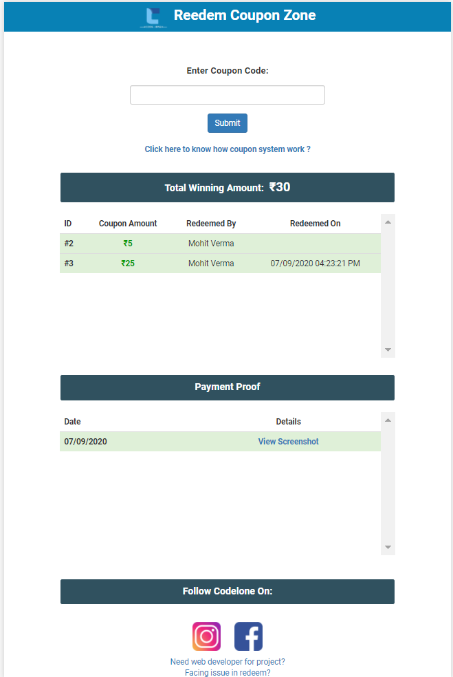
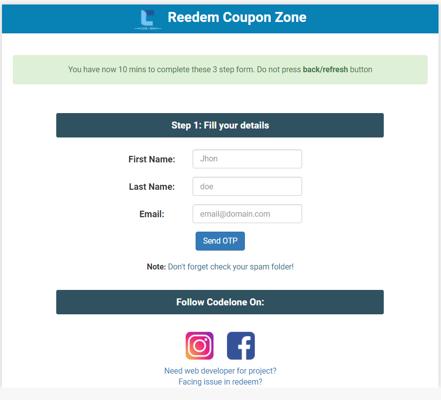
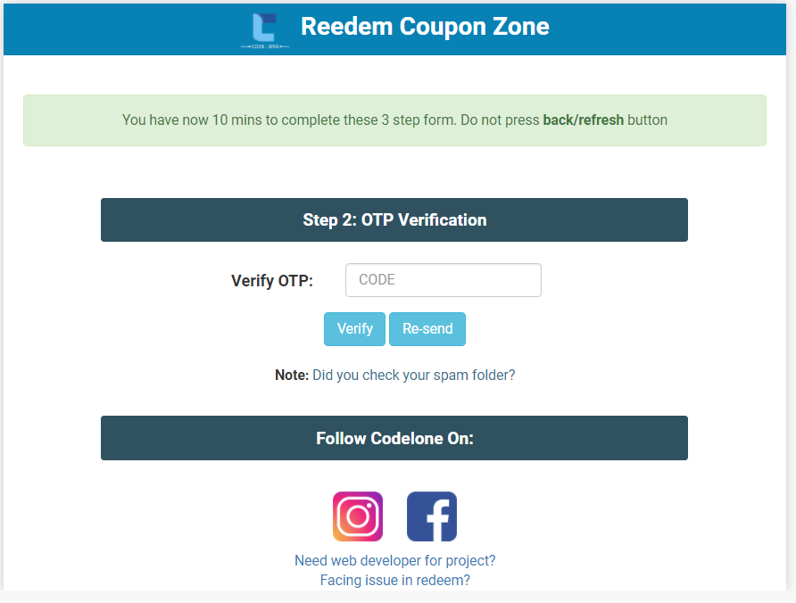
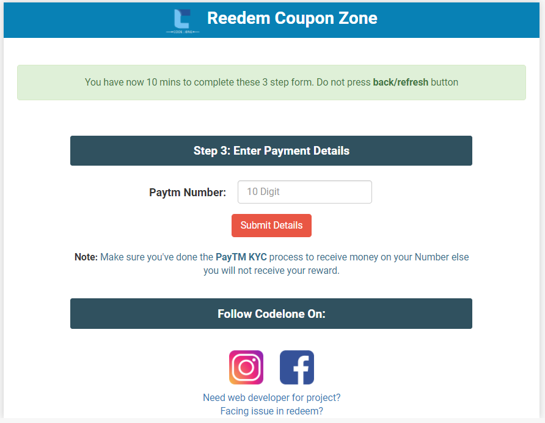

# About
Airtm is a tool to increase youtube subscribers just by giving users to free Paytm coupon codes.
# How its works?
Once your youtube channel is setup, You need to edit a video in such a way that your free coupon show randomly at any point in your youtube video. This way your subscribers cannot predict your coupon display timming in your video. Ultimately users have to watch all the way along your video to find free coupon. Once they findout they need to enter coupon inside Airtm tool to redeem it.
# Redeem coupon in 4 steps
1. STEP: Enter coupon.

2. STEP: Enter details.

3. STEP: Enter OTP salt.

4. STEP: Enter Paytm Number.


# Installation

> Put zip file into your `wamp/www` folder and unzip there.
> Import `SQL` file into myphpadmin.

# SMTP Config
Setup SMTP config according to you in `include/function.php`
```PHP
$mail->Host = 'HOST';//server host here
$mail->Username = 'USERNAME'; //server email
$mail->Password = 'PASSWORD'; // server password
$mail->setFrom('EMAIL@GMAIL.COM');
$mail->addReplyTo('EMAIL@GMAIL.COM');
```
# Test
 Rs.10 Paytm coupon `AY65HDSDRFDW`


